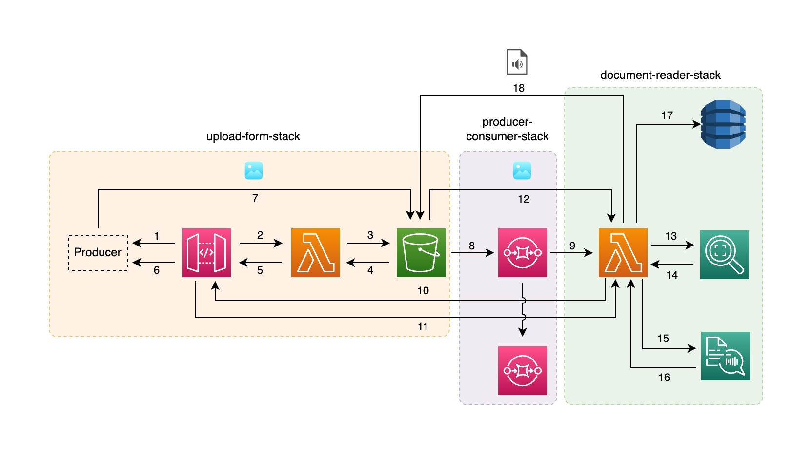

## Serverless-cdk-stack <!-- omit in toc -->

AWS Serverless CDK Stack deployed leveraging stack inheritance.

This architecture was presented at the [AWS Summit 2023](https://aws.amazon.com/it/events/summits/milano/agenda/?emea-event-agenda-card.sort-by=item.additionalFields.title&emea-event-agenda-card.sort-order=asc&awsf.emea-event-agenda-level=*all&awsf.emea-event-agenda-role=*all&awsf.emea-event-agenda-category=*all&awsf.emea-event-agenda-aws-industry=*all&emea-event-agenda-card.q=COM204&emea-event-agenda-card.q_operator=AND#session) in Milan (June 23) at the AWS Community Lounge. A PDF version of the slide are available at [madeddu.xyz/aws_summit_2023.pdf](https://madeddu.xyz/aws_summit_2023.pdf)

## Contents
- [Contents](#contents)
  - [Big Picture](#big-picture)
  - [Requirements](#requirements)
  - [Build and deploy](#build-and-deploy)
    - [Testing things](#testing-things)
  - [Note by owner](#note-by-owner)
  - [Useful commands](#useful-commands)

### Big Picture



The architecture presented shows the three stacks available separately in this repository under the `/templates` folder: the first stack creates a basic upload-form, the second one is built on top on the first and create a producer/consumer chain. The third stack leverages the first two by creating a pipeline for running images text-recognition and then text-to-speech, providing a basic serverless backend to build for an OCR application.

- [Upload Form](https://github.com/made2591/serverless-cdk-stacks/blob/main/templates/upload-form/README.md): creates the serverless infrastructure required to build an upload form by using [AWS API Gateway](https://aws.amazon.com/api-gateway/), [AWS Lambda](https://aws.amazon.com/lambda/) and [AWS Simple Storage Service](https://aws.amazon.com/s3/).
- [Producer/Consumer](https://github.com/made2591/serverless-cdk-stacks/blob/main/templates/producer-consumer/README.md): creates the serverless infrastructure following the producer/consumer schema using [AWS API Gateway](https://aws.amazon.com/api-gateway/), [AWS Lambda](https://aws.amazon.com/lambda/), [AWS Simple Storage Service](https://aws.amazon.com/s3/) and [AWS Simple Queue Service](https://aws.amazon.com/sqs/).
- [Document Reader](https://github.com/made2591/serverless-cdk-stacks/blob/main/templates/document-reader/README.md): creates a serverless infrastructure to build OCR application that produce spoken text extracted from images you can provide throught REST API by using many services like [AWS API Gateway](https://aws.amazon.com/api-gateway/), [AWS Lambda](https://aws.amazon.com/lambda/), [AWS Simple Storage Service](https://aws.amazon.com/s3/), [AWS Simple Queue Service](https://aws.amazon.com/sqs/), [AWS DynamoDB](https://aws.amazon.com/dynamodb/), [AWS Rekognition](https://aws.amazon.com/rekognition/) and [AWS Polly](https://aws.amazon.com/polly/), to provide text-to-speach functionality;

### Requirements

The only requirements you need is
- [Node.js](https://nodejs.org/en);
- [AWS CDK](https://docs.aws.amazon.com/cdk/v2/guide/getting_started.html) package - v2;
- An AWS Account configured for your CLI;

### Build and deploy

**NOTE**: nefore following the instruction below follow the [Bootstrapping](https://docs.aws.amazon.com/cdk/v2/guide/bootstrapping.html) guidelines to correctly enable your AWS account to provision resources and deploy AWS CDK app.

To build and deploy the stack into your account, just run:

```npm install && npm run build```

and then

```cdk deploy```

After a while, the whole stack should be deployed. If this is not true, have a look at AWS CDK output or let me know by opening an issue.

#### Testing things

Inside each folder there's a script to test each stack - is not rocket science, just a few bash lines to see if everything works the right way.

To test the stack just get the API Gateway url provided as output from the `cdk deploy` and provide it to the script. Then, from each stack folder, run the following:

```./test.sh```

For the document-reader stack, an example image is provided with text and can be used to verify the result. The test script point to the image inside the `/img/sample` folder;

### Note by owner

The stacks are not **production** ready since they don't deploy anything "secure" - no auth method is provided or similar. Just use these stacks as they are intended to be, a bootstrap for something to adapt and evolve to be used in a real production scenario.

Hope you enjoy it!

The `cdk.json` file tells the CDK Toolkit how to execute your app.

### Useful commands

* `npm run build`   compile typescript to js
* `npm run watch`   watch for changes and compile
* `npm run test`    perform the jest unit tests
* `cdk deploy`      deploy this stack to your default AWS account/region
* `cdk diff`        compare deployed stack with current state
* `cdk synth`       emits the synthesized CloudFormation template
