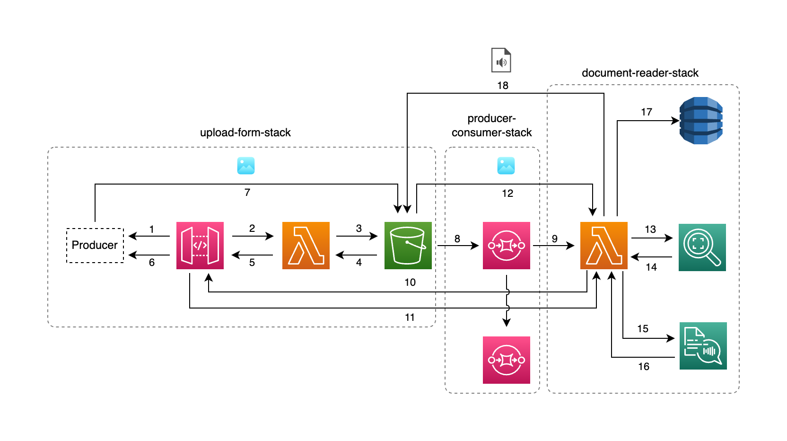

## Document-reader-cdk-stack <!-- omit in toc -->

AWS Serverless CDK Stack deployed leveraging stack inheritance.

This architecture was presented at the [AWS Summit 2023](https://aws.amazon.com/it/events/summits/milano/agenda/?emea-event-agenda-card.sort-by=item.additionalFields.title&emea-event-agenda-card.sort-order=asc&awsf.emea-event-agenda-level=*all&awsf.emea-event-agenda-role=*all&awsf.emea-event-agenda-category=*all&awsf.emea-event-agenda-aws-industry=*all&emea-event-agenda-card.q=COM204&emea-event-agenda-card.q_operator=AND#session) in Milan (June 23) at the AWS Community Lounge. A PDF version of the slide are available at [madeddu.xyz/aws_summit_2023.pdf](https://madeddu.xyz/aws_summit_2023.pdf)

## Contents
- [Contents](#contents)
  - [Big Picture](#big-picture)
  - [Requirements](#requirements)
  - [Build and deploy](#build-and-deploy)
    - [Testing things](#testing-things)
  - [Note by owner](#note-by-owner)
  - [Useful commands](#useful-commands)

### Big Picture



The architecture presented shows the document-reader stack available in this repository under the `/templates/document-reader` folder: this stack adds on top of the producer/consumer stack a consumer AWS Lambda that perform three different task. Let's see them in details

1-7 See steps from [upload form](https://github.com/made2591/serverless-cdk-stacks/blob/main/templates/upload-form/README.md) stack;

8-12 See steps from [producer/consumer](https://github.com/made2591/serverless-cdk-stacks/blob/main/templates/producer-consumer/README.md);

13-14 AWS Lambda ask to [AWS Rekognition](https://aws.amazon.com/rekognition/) to get text out from the images;

15-16 AWS Lambda ask to [AWS Polly](https://aws.amazon.com/polly/) to get mp3 out of text;

17 Some metadata around the processing are stored inside [AWS DynamoDB](https://aws.amazon.com/dynamodb/);

18 The MP3 text is stored on S3;

### Requirements

The only requirements you need is
- [Node.js](https://nodejs.org/en);
- [AWS CDK](https://docs.aws.amazon.com/cdk/v2/guide/getting_started.html) package - v2;
- An AWS Account configured for your CLI;

### Build and deploy

**NOTE**: nefore following the instruction below follow the [Bootstrapping](https://docs.aws.amazon.com/cdk/v2/guide/bootstrapping.html) guidelines to correctly enable your AWS account to provision resources and deploy AWS CDK app.

To build and deploy the stack into your account, just run:

```npm install && npm run build```

and then

```cdk deploy```

**NOTE**: before proceeding, this stack require you to setup a couple of env variables:

- `READ_CAPACITY`: The read capacity of the dynamodb table to store the translation event;
- `WRITE_CAPACITY`: The write capacity of the same dynamodb table;
- `PARTITION_KEY`: The partition key to use for the object stored;
  
You can use the following script before running the deploy command above to set reasonable values:

```bash
export READ_CAPACITY=5
export WRITE_CAPACITY=1
export PARTITION_KEY='id'
```

After a while, the whole stack should be deployed. If this is not true, have a look at AWS CDK output or let me know by opening an issue.

#### Testing things

To test the stack just get the API Gateway url provided as output from the `cdk deploy` and provide it to the script. Then, from each stack folder, run the following:

```./test.sh```

To make the bootstrap simpler, the MP3 is available with the action `getResult` - look at the `./test.sh` withouth passing from DynamoDB. More complex logic can be put in place to handle stuff.

### Note by owner

The stacks are not **production** ready since they don't deploy anything "secure" - no auth method is provided or similar. Just use these stacks as they are intended to be, a bootstrap for something to adapt and evolve to be used in a real production scenario.

Hope you enjoy it!

The `cdk.json` file tells the CDK Toolkit how to execute your app.

### Useful commands

* `npm run build`   compile typescript to js
* `npm run watch`   watch for changes and compile
* `npm run test`    perform the jest unit tests
* `cdk deploy`      deploy this stack to your default AWS account/region
* `cdk diff`        compare deployed stack with current state
* `cdk synth`       emits the synthesized CloudFormation template
