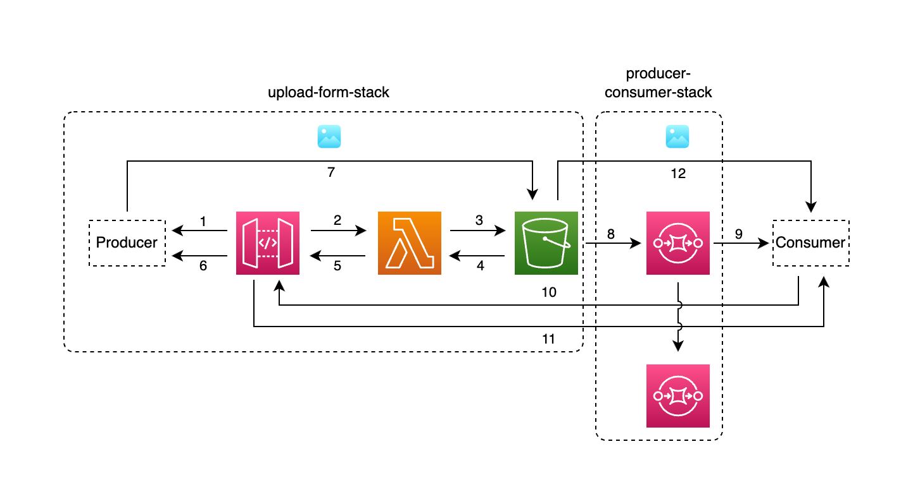

## Producer-consumer-cdk-stack <!-- omit in toc -->

AWS Serverless CDK Stack deployed leveraging stack inheritance.

This architecture was presented at the [AWS Summit 2023](https://aws.amazon.com/it/events/summits/milano/agenda/?emea-event-agenda-card.sort-by=item.additionalFields.title&emea-event-agenda-card.sort-order=asc&awsf.emea-event-agenda-level=*all&awsf.emea-event-agenda-role=*all&awsf.emea-event-agenda-category=*all&awsf.emea-event-agenda-aws-industry=*all&emea-event-agenda-card.q=COM204&emea-event-agenda-card.q_operator=AND#session) in Milan (June 23) at the AWS Community Lounge. A PDF version of the slide are available at [madeddu.xyz/aws_summit_2023.pdf](https://madeddu.xyz/aws_summit_2023.pdf)

## Contents
- [Contents](#contents)
  - [Big Picture](#big-picture)
  - [Requirements](#requirements)
  - [Build and deploy](#build-and-deploy)
    - [Testing things](#testing-things)
  - [Note by owner](#note-by-owner)
  - [Useful commands](#useful-commands)

### Big Picture



The architecture presented shows the producer/consumer stack available in this repository under the `/templates/producer-consumer` folder: this stack adds on top of the upload form an SQS Queue with event for object creation. A dead-letter queue is created as well for errors. More in detail:

1-7 See steps from [upload form](https://github.com/made2591/serverless-cdk-stacks/blob/main/templates/upload-form/README.md) stack;

8 S3 create object event are propagated to a dedicated SQS Queue. In case of failure, a dead-letter queue is created as well;

9 Consumer can proceed in retrieving object key;

10-11 Afterward, passing through API (consumer could be not authorized) a presigned URL can be used to retrieve object;

12 Object is actually retrieved for processing;

### Requirements

The only requirements you need is
- [Node.js](https://nodejs.org/en);
- [AWS CDK](https://docs.aws.amazon.com/cdk/v2/guide/getting_started.html) package - v2;
- An AWS Account configured for your CLI;

### Build and deploy

**NOTE**: nefore following the instruction below follow the [Bootstrapping](https://docs.aws.amazon.com/cdk/v2/guide/bootstrapping.html) guidelines to correctly enable your AWS account to provision resources and deploy AWS CDK app.

To build and deploy the stack into your account, just run:

```npm install && npm run build```

and then

```cdk deploy```

After a while, the whole stack should be deployed. If this is not true, have a look at AWS CDK output or let me know by opening an issue.

#### Testing things

To test the stack just get the API Gateway url provided as output from the `cdk deploy` and provide it to the script. Then, from each stack folder, run the following:

```./test.sh```

Keep in mind that a consumer is not defined thus the SQS message will stay ready to be delivered for the maximum amount of time. This use case just let you understand principle of stack inheritance to let you leverage the previous code.

### Note by owner

The stacks are not **production** ready since they don't deploy anything "secure" - no auth method is provided or similar. Just use these stacks as they are intended to be, a bootstrap for something to adapt and evolve to be used in a real production scenario.

Hope you enjoy it!

The `cdk.json` file tells the CDK Toolkit how to execute your app.

### Useful commands

* `npm run build`   compile typescript to js
* `npm run watch`   watch for changes and compile
* `npm run test`    perform the jest unit tests
* `cdk deploy`      deploy this stack to your default AWS account/region
* `cdk diff`        compare deployed stack with current state
* `cdk synth`       emits the synthesized CloudFormation template
